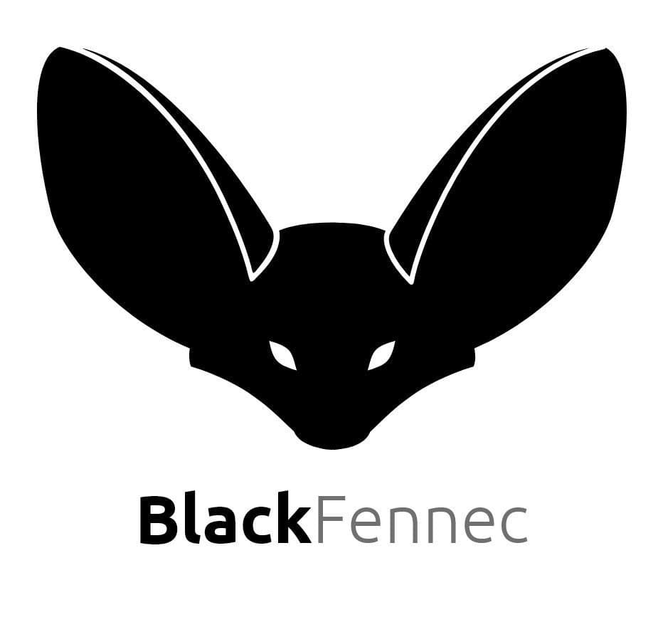

[![pipeline badge][pipeline-badge]][commits]
[![coverage report][coverage-badge]][commits]
[![Pylint score][pylint-badge]][pylint-log]
[![Latest Release][release-badge]][releases]

<!-- PROJECT LOGO -->
<br />
<div align="center">
  <p>
    <a href="https://gitlab.ost.ch/blackfennec/blackfennec">
      
    </a>
  </p>
  <p align="center">
    bring structure for chaos
    <br />
    <a href="http://blackfennec.pages.gitlab.ost.ch/blackfennec/"><strong>Explore the docs »</strong></a>
    <br />
    <br />
    <a href="https://github.com/blackfennec-org/blackfennec/issues">Report Bug</a>
    ·
    <a href="https://github.com/blackfennec-org/blackfennec/issues">Request Feature</a>
  </p>
</div>


<!-- TABLE OF CONTENTS -->

## Table of Contents

- [Table of Contents](#table-of-contents)
- [About The Project](#about-the-project)
  * [Powered By](#powered-by)
- [Getting Started](#getting-started)
  * [Flathub Installation](#flathub-installation)
  * [Local Installation](#local-installation)
    + [Prerequisites](#prerequisites)
    + [Installation](#installation)
    + [Usage](#usage)
- [Roadmap](#roadmap)
- [Contributing](#contributing)
- [License](#license)


<!-- ABOUT THE PROJECT -->

## About The Project

[![Black-Fennec Screen Shot][product-screenshot]](product-screenshot)

Black Fennec is able to view and edit semi-structured data such as JSON by interpreting information compositions known to its type system. These interpretations are then visualised. The type system in its nature is a weakly typed dynamic object model that can be extended easily. To support specialised use cases and allow rapid development Black Fennec provides an extension api which allows users to extend the type system with their own custom types and visualisations.

### Powered By

* [GTK4](https://gtk.org/gtk4/)
* [Libadwaita](https://gitlab.gnome.org/GNOME/libadwaita)
* [Python](https://www.python.org/)
* [Pytest](https://pytest.org/)

<!-- GETTING STARTED -->

## Getting Started

### Flathub Installation

Black Fennec is available from Flathub. Preferably install it from your distribution's package manager.

Otherwise it is also directly available from Flathub. To install click the button below:

[![Get it on Flathub][flathub-badge]][flathub]

### Local Installation

#### Prerequisites

To run Black-Fennec one needs python 3.10 installed on the computer.

Additionally the following OS-level dependencies are required:

```sh
sudo dnf install python3-devel cairo cairo-devel gobject-introspection-devel cairo-gobject-devel
```

#### Installation

Clone the repo

```sh
git clone https://gitlab.ost.ch/blackfennec/blackfennec.git --recurse-submodules
```

Install PIP packages

```sh
make dependencies
```

#### Usage

```sh
make run
```

<!-- ROADMAP -->

## Roadmap

See the [open issues](https://gitlab.ost.ch/blackfennec/blackfennec/issues) for a list of proposed features (and known
issues).

<!-- CONTRIBUTING -->

## Contributing

1. Fork the Project
2. Create your Feature Branch (`git checkout -b feature/AmazingFeature`)
3. Commit your Changes (`git commit -m 'Add some AmazingFeature'`)
4. Push to the Branch (`git push origin feature/AmazingFeature`)
5. Open a Pull Request

<!-- LICENSE -->

## License

Distributed under the GNU General Public License. See `LICENSE` for more information.

<!-- MARKDOWN LINKS & IMAGES -->
<!-- https://www.markdownguide.org/basic-syntax/#reference-style-links -->

[pipeline-badge]: https://gitlab.ost.ch/blackfennec/blackfennec/badges/dev/pipeline.svg

[coverage-badge]: https://gitlab.ost.ch/blackfennec/blackfennec/badges/dev/coverage.svg

[pylint-badge]: https://gitlab.ost.ch/blackfennec/blackfennec/-/jobs/artifacts/dev/raw/pylint/pylint.svg?job=run%20linter

[pylint-log]: https://gitlab.ost.ch/blackfennec/blackfennec/-/jobs/artifacts/dev/raw/pylint/pylint.log?job=run%20linter

[release-badge]: https://gitlab.ost.ch/blackfennec/blackfennec/-/badges/release.svg

[releases]: https://gitlab.ost.ch/blackfennec/blackfennec/-/releases

[commits]: https://gitlab.ost.ch/blackfennec/blackfennec/-/commits/dev

[issues-url]: https://gitlab.ost.ch/blackfennec/blackfennec/issues

[product-screenshot]: docs/source/images/screenshots/blackfennec.png

[flathub-badge]: https://flathub.org/assets/badges/flathub-badge-en.png

[flathub]: https://flathub.org/apps/details/org.blackfennec.app