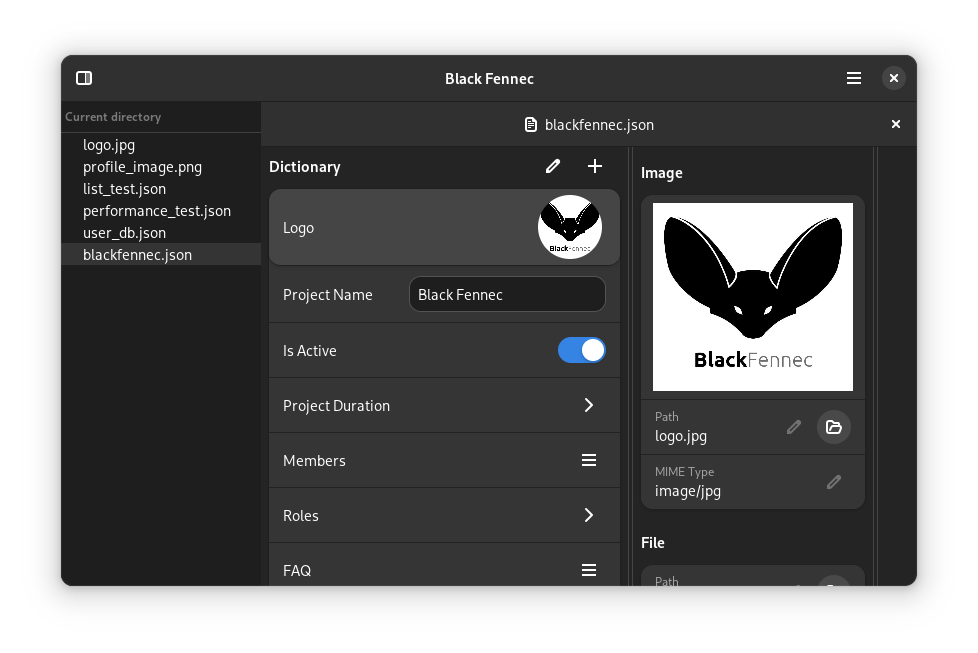

========================
Welcome to Black Fennec!
========================

`Black Fennec <https://blackfennec.org>`_ is a free and open source software. It is a simple and easy to use application for viewing and editing semi-structured data like JSON in a visually interpreted form. It is written in Python and uses GTK4 and Libadwaita for the user interface.

Find out more about this project in these pages.

Usage
"""""

:ref:`Here <usage>` you will learn how to install and use Black Fennec. This section is intended for users who want to use Black Fennec and somehow stumbled upon this documentation.

Development
"""""""""""

:ref:`This section <development>` is intended for developers who want to contribute to Black Fennec. It contains information about the :ref:`architecture of the application <Architecture>` and the :ref:`domain model <domain_model>`, how to build it and how to contribute to the project.

Additionally it provides a guide on :ref:`how to write extensions <definition_extension_development>` for Black Fennec.

Project
"""""""

The :ref:`project section <project>` contains information about the project itself. This includes information about the process of creating the application such as the :ref:`project management <project_management>`, the :ref:`requirements engineering <requirements_engineering>` and the :ref:`project standards <project_standards>`.

.. toctree::
    :hidden:

    usage/index
    development/index
    project/index
    genindex
