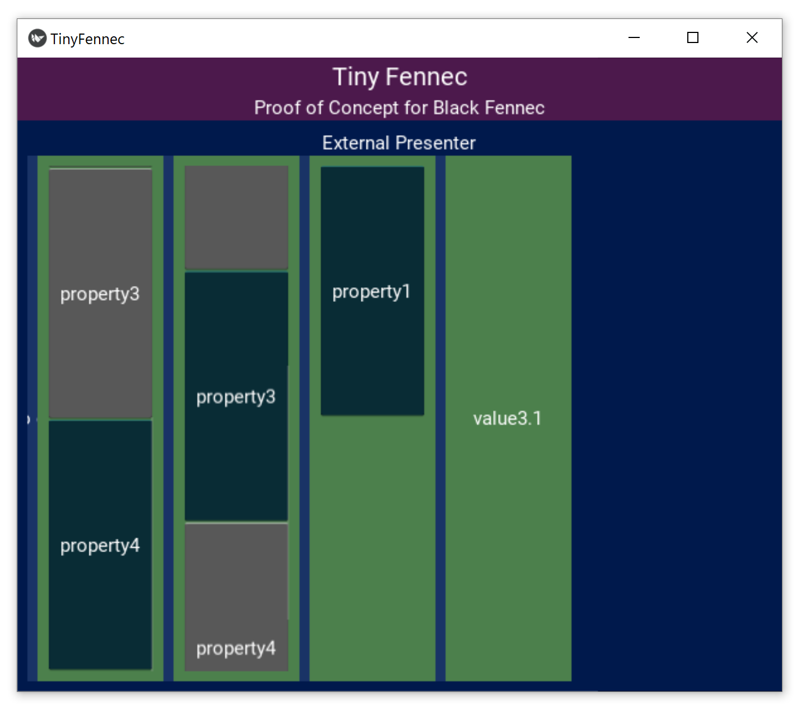
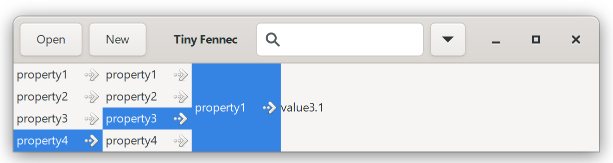
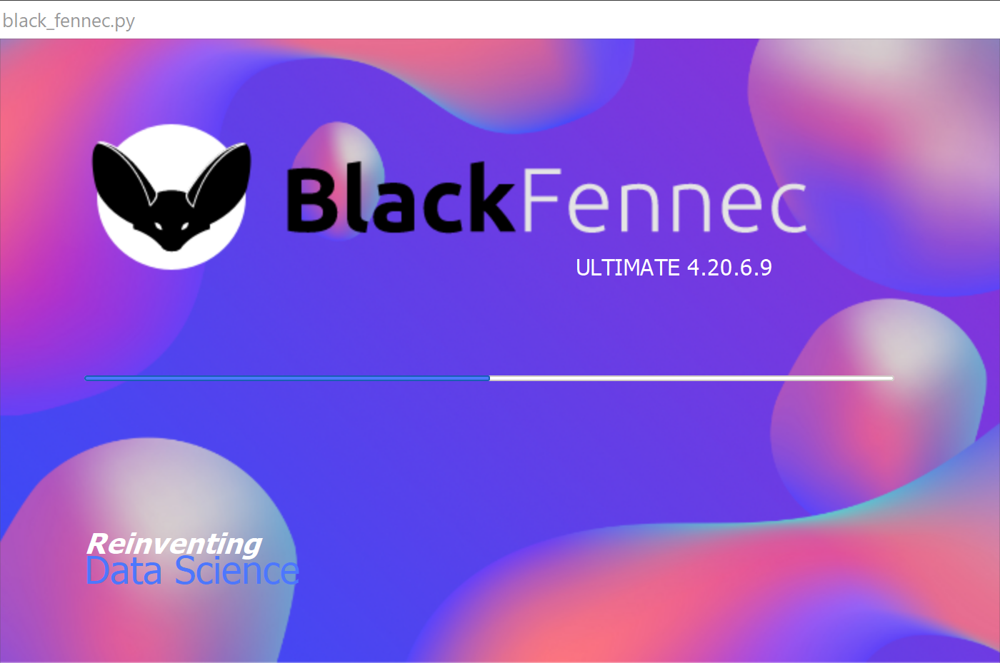
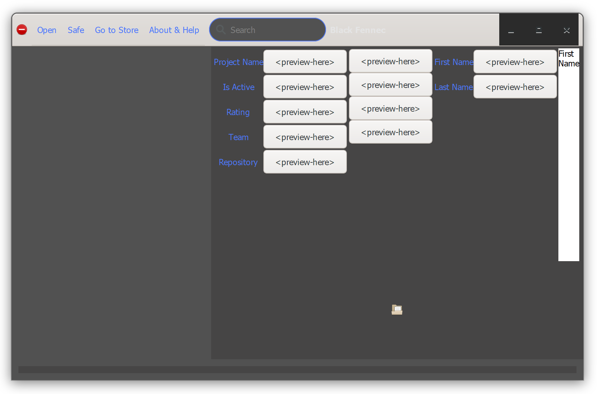

===========
Elaboration
===========

This document is a starting point to provide a limited overview over the progress that was made during the Elaboration phase. To not only getting a limited overview it is encouraged to take a look at the code that was produced during this phase. The document includes the mention of the created prototypes and the respecting addressed risks and a detailed :ref:`Construction Phase Plan <construction_phase_plan>`.

Prototype Evaluation
====================
Two prototypes were created to assess risks accurately, test out new technologies and new concepts. The first prototype called tiny fennec due to its inclusion of the final concepts in a simplified manner was created before the project was started to ensure that nothing serious could prevent the project from being successful. The second prototype was produced during the elaboration phase to minimize the remaining risks that were documented in the :doc:`../risk_analysis` done in the inception phase.

Tiny Fennec
-----------
The Tiny Fennec prototype can be found under the following `link <https://gitlab.ost.ch/tinyfennec/tinyfennec>`_.
In this chapter a preview of the prototype is shown, and the assessed risks are described.

Prototype Preview
^^^^^^^^^^^^^^^^^

The prototype is not a total spike solution but rather focussed on the feasibility of certain components and concepts. This is why for example the :ref:`underlay <definition_underlay>` is mocked and no :ref:`source layer <definition_source_layer>` exists.

The two previews shown represent each a different GUI framework, but both include essentially the same functionality.

Kivy
""""

GTK 3.0
""""""""

Addressed Risks
^^^^^^^^^^^^^^^

=====================  ======================
 Risk                   Conclusion
=====================  ======================
CI/CD                   First CI/CD scripts were created, that were able to run the testing framework with a coverage analysis and inclusion of the results in Gitlab. The confidence in the Gitlab infrastructure was established and the pipeline creation syntax mastered on a medium level.
Testing                 The project includes a test-coverage of 97% and different strategies to ensure testing of components is completely independent were tried. Creation of Doubles and inclusion of dependency injection principle was tried.
Logging                 Logging was tried out to ensure it functionality, and provisional logging strategy was created.
GUI framework           The GUI-frameworks Kivy and GTK version 3 were tried, and the prototype was fully implemented using either framework. The prototype was first created with Kivy and then replaced by GTK 3.0. This also addressed the risk of not being able to exchange the GUI framework. In the end GTK 3.0 was chosen to be used due to the existence of a WYSIWYG editor for the GUI, lesser interference with python, and the possibility of lower coupling of the ViewModel to the View.
User Interface          The concept of a presenter handling the self created widgets of the extensions(types) was tried to ensure the feasibility of this idea. This concept worked out well with either GUI framework.
Extension management    Different possibilities of extension management were though through, and the simplest and most powerful solution was the usage of the python extension system with pip and the Python package index (PyPI). For this approach the best practices were evaluated and then implemented in the prototype. The function of it was tested by outsourcing the presenter into a extension and loading it with a Python Wheel.
=====================  ======================

Black Fennec Architectural Prototype
------------------------------------
The Black Fennec architectural prototype can be found under the release tag v0.3.0 and is part of the projects gitlab.
In this chapter a preview of the prototype is shown, and the assessed risks are described.

Prototype Preview
^^^^^^^^^^^^^^^^^
The Black Fennec architectural prototype is a spike solution and is able to open and parse JSON files, and show their data. In the prototype the json types are being handled and thus any JSON file can be viewed. Under the subsection `Main Window`_ an example file representing project metadata can be seen as it is presented in the prototype. The prototype includes most of the required domain concepts, and is written to be extended easily with additional features.

Loading Screen
""""""""""""""

The loading screen of the prototype is to be extended to contain status updates and thus until now the progress bar remains to be stationary.

Main Window
"""""""""""

As this is a prototype, some of the already displayed functionalities such as saving a file, accessing the extension store or showing a help are not implemented. Also the concept of previews of data are to be implemented but are planned in the construction phase. Because of this items of a list are not identifiable. One there can imagine a compact view of the most important value of the type contained in the list.

Addressed Risks
^^^^^^^^^^^^^^^
All risk included in this table correspond to a heading in the :doc:`../risk_analysis` document.

.. table::
    :widths: 25 75

    ======================================================  ======================
     Risk                                                    Conclusion
    ======================================================  ======================
    :ref:`Reaching the Complexity Ceiling <risk_analysis>`  In order to mitigate and minimize this risk a great deal of time was spent to refine and refactor concepts in the core such as the auctioneer and navigation service. Thanks to this measure we are confident that the complexity encountered during this project in manageable. But still a complete mitigation of this risk can never be claimed, and thus we have to keep this risk in mind.
    :ref:`Changing Requirements <risk_analysis>`            During the elaboration phase the requirements of our project have been concretised, and thanks to this we can conclude that this already very low risk has further been lowered.
    :ref:`Documentation Tools <risk_analysis>`              The prototype features an extensive documentation in the form of docstrings. Contrary to popular belief that docstrings are not maintainable and do not add worthwhile value, our team decided to use docstrings especially to ensure that external extension developers can understand the underlying code of the Black Fennec core with lower time investments. We deliberately refrain from documenting our tests and doubles, but core code is to be documented at all times. We believe our documentation tools to be adequate and thus see this risk as mitigated.
    :ref:`Development Tools <risk_analysis>`                The members of the project have set up their IDEs preceding the start of the elaboration phase as a part of the inception phase. Now up to this point all members have made contact with all the development tools and any occurring problems were successfully solved.
    :ref:`Low Software Quality <risk_analysis>`             Our Prototype adheres strictly to our quality standards, and with the inclusion of a code quality rating with pylint this risk has been mitigated. Up to this point all members of the team have made contact with the quality standards and know how to adhere to them.
    :ref:`Bad User Experience <risk_analysis>`              This long-term risk still exists for our project, but with the assignment of one team member that is has the competence to ensure best possible user experience, at least a bit of this risk has been mitigated.
    ======================================================  ======================

Retained Risks
^^^^^^^^^^^^^^

======================================================  ======================
 Risk                                                    Conclusion
======================================================  ======================
:ref:`Third Party Component <risk_analysis>`            As already stated in the :doc:`../risk_analysis` this risk was retained an remains in this state, as it is not feasible in the scope of this project to provide a mitigation for this risk.
======================================================  ======================

.. _construction_phase_plan:

Construction Phase Plan
=======================
The overall timeline of our project was created during the inception phase and also is included in the :doc:`project_plan`. During the course of the Elaboration phase it was adjusted slightly but besides the prolongation of the elaboration phase the plan remained identical.

.. uml:: project_timeline.puml

The Construction phase spanning at least the two next iterations is planned more detailed in the following diagram. Additionally to this plan, a look into the `issue board <https://gitlab.ost.ch/epj/2021-FS/g01_blackfennec/black-fennec/-/boards/240>`_ can be worthwhile to get a picture of the current and planned processes.

The timeline we provide is a gantt diagram to visualise dependencies of certain component of our system and provides a detailed planning overview. This plan is just a provisional aid for the creation of stories and work-items during the sprint planning meetings, and is thus subject to change.

.. uml:: construction_phase_roadmap.puml