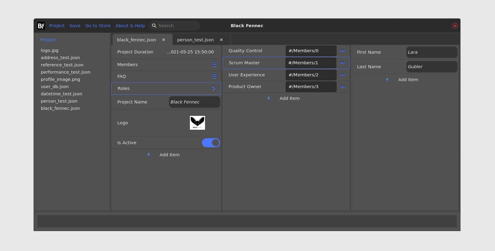
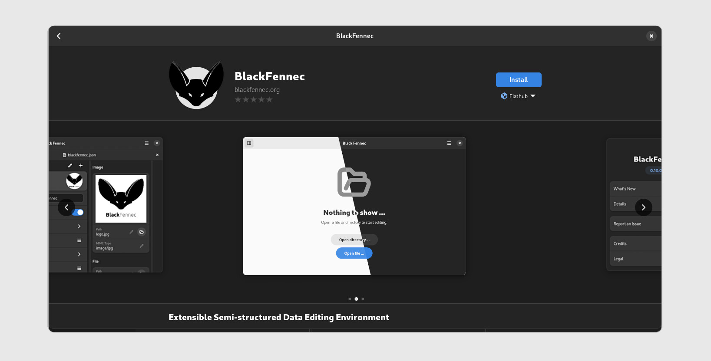
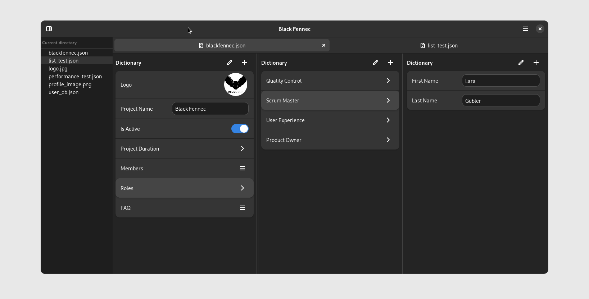

========
Abstract
========

Introduction
""""""""""""

Black Fennec is a simple and easy to use application for viewing and editing semi-structured data like JSON in a visually interpreted form. The target audience are people that come in contact with such data on a regular basis and want to collect and manage it in an accessible way. As such it is positioned between Microsoft Word and Access and can be understood as a data editor.

It was originally developed by Lara Gubler, Leonie Däullary, Simon Kindhauser, Caspar Martens as an engineering project with Thomas Kälin as supervisor. Building on the aforementioned work, the goal of this project was to release Black Fennec as a stable and mature product with major quality of life improvements that potential users are keen to use.

    State of the application before the project at version 0.6.

Approach / Technology
"""""""""""""""""""""

Improving the stability of the application included major refactorings to many components of the application. Architecture wise some of the most significant changes were made to the document subsystem, extension handling and the type system. This was made possible by a extensive and largely pre-existing automated test suite.

The test suite itself also received a major overhaul. The pre-existing suite, which was using the python unittest package, was largely extended and simplified through the use of pytest. To acquire the necessary skills the developers took part in a multi-day workshop organized by members of the pytest community. Currently a thousand tests cover around 98% of the code base (branch coverage).

Thanks to the migration to GTK 4 and the use of libadwaita, the application integrates seamlessly into the GNOME desktop environment. It also improves the maintainability by providing a large set of components that are responsive and user friendly by design. We leveraged these technologies in an effort to improve the user experience of the application. Amongst other things, this included the addition of application feedback and better error handling.

With the introduction of actions to the extension ecosystem, we have also created a new way of interacting with the application. Actions allow the execution of previously defined operations that operates on a selected data structure. Overall, the extension API has matured and now offers a smorgasbord of extension points including actions, mime types and more.

As a means of distribution, the application is now available as a flatpak package on Flathub. This allows for integrated installation and updates on all major Linux distributions through their native software center. Another advantage of flatpak is that it provides a sandboxed environment that adds another layer of security and protects our users from malicious intents.

    Gnome software store with Black Fennec. The application is available via Flathub and thus any Linux distribution.

Result
""""""

We are happy to announce that Black Fennec is now available as a stable and mature product. The application can be downloaded from Flathub and installed on virtually any Linux distribution. Complementary to the release of the application, we also published a simplistic website with all relevant information including a short description, a screenshot and links to other relevant resources.

The website is available at https://blackfennec.org.

    Final release of Black Fennec at version 1.0.
