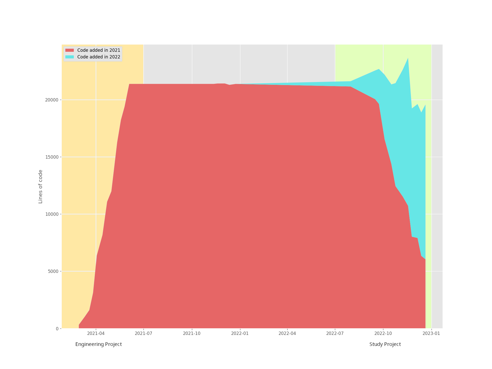
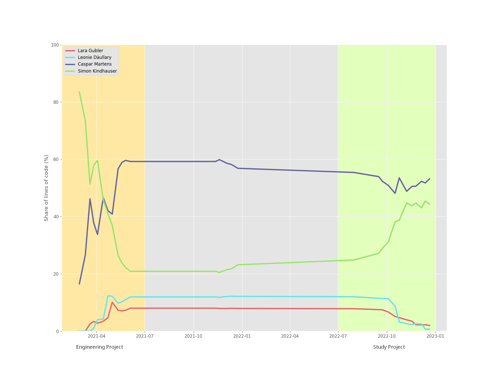
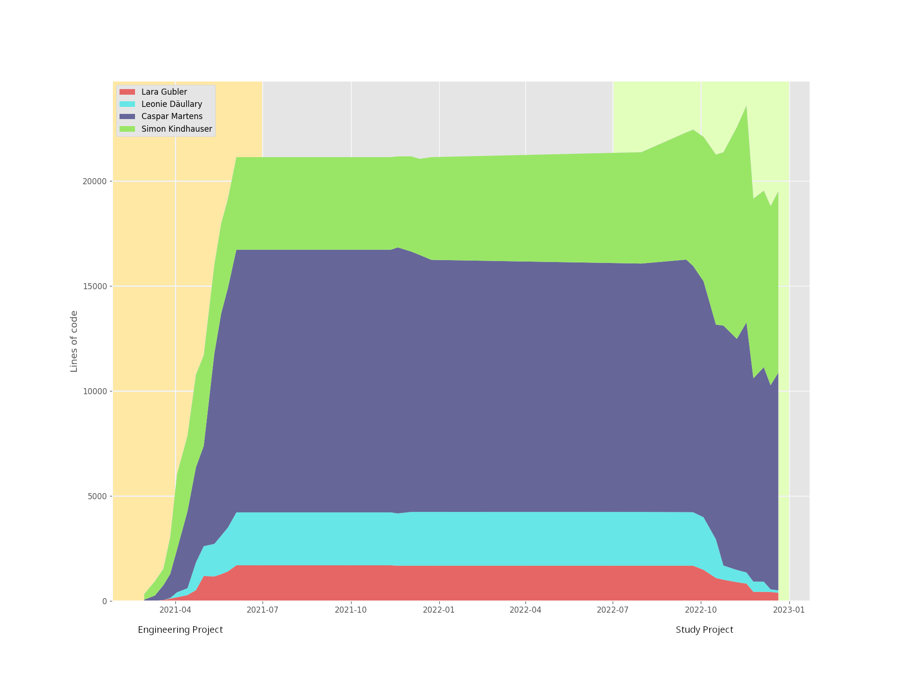
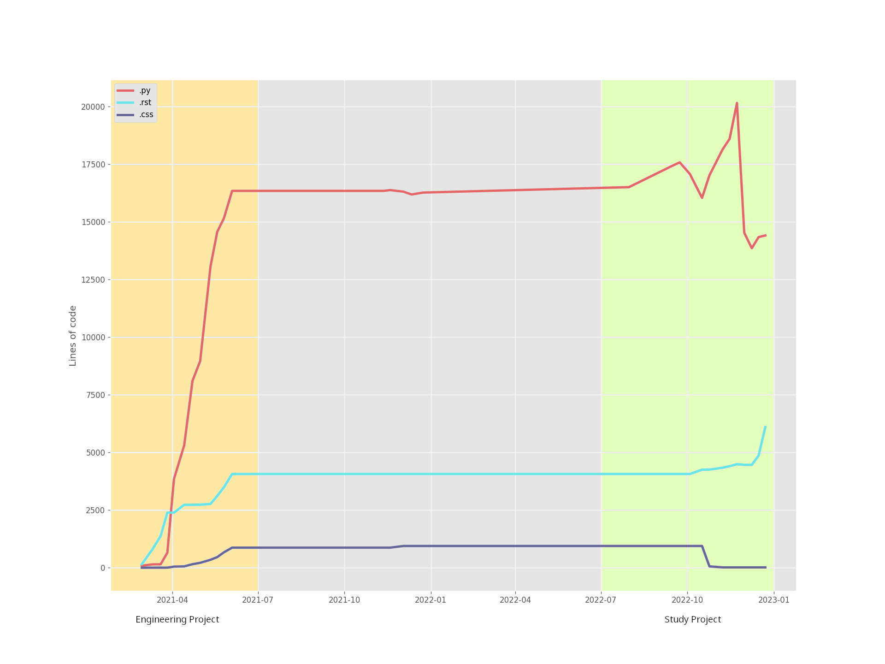

.. _increment:

=========
Increment
=========

The increment between version 0.6 and 1.0 represents the changes and improvements made to the codebase during the study project. To gain an overview over the changes, multiple resources exist as a reference. In the `milestones <https://gitlab.ost.ch/blackfennec/blackfennec/-/milestones>`_ one can see which issues were associated with which release. The `changelog <https://gitlab.ost.ch/blackfennec/blackfennec/-/blob/dev/CHANGELOG.md>`_ contains a list of all changes made to the codebase. The `commit history <https://gitlab.ost.ch/blackfennec/blackfennec/-/commits/dev>`_ shows all commits made to the codebase. The `merge request <https://gitlab.ost.ch/blackfennec/blackfennec/-/merge_requests/107>`_ between the two versions shows all changes made to the codebase.

As these resources are not easily accessible to gain an overview, the following visualisations will give a short overview over the changes made to the codebase.

   Lines of code split per year showing the changes made to the codebase.

The diagram illustrates the significant changes to the codebase, which were not only comprised of additions but also numerous refactorings. However, it should be noted that the decrease in lines of code (LOC) may be partially attributed to the transition from a monolithic repository to a multi-repository structure, which involved the removal of the core and base extensions.

    Percentage of code written per author.

The above figure presents the proportion of code written by each author in the codebase. It is evident that all of the code was created by the members of the two projects, with the leading author accounting for more than 50% of the code in the :ref:`engineering project <engineering_project>`. However, it is important to acknowledge that this data does not necessarily reflect the complete contributions of each author to the project, as it only considers the lines of code written and does not take into account other forms of contribution such as documentation, code review, and pair programming.
During the course of this project, the difference in the amount of code written by each member was reduced as a result of significant refactoring by the two project members. This refactoring is also evident when examining the LOC contributed by the members of the :ref:`engineering project <engineering_project>` that were no longer part of the succeeding project.

    Lines of code split per author showing the changes made to the codebase.

Here in this figure it shows the changes made to the codebase over time, with the lines of code written by each author stacked on top of each other. It is clear from this figure that the codebase has undergone significant changes, with both additions and deletions of code over time. The decrease in the overall number of lines of code can partially be attributed to the transition from a monolithic repository to a multi-repository structure, which involved the removal of the core and base extensions. Another factor for the decrease in lines of code is due to refactorings and other code cleanups performed by the authors.

    Lines of code split per extension showing the changes made to the codebase.

The figure above illustrates the changes made to the codebase over time, with the lines of code written for each file extension shown separately. A notable change is the decrease in the number of lines of code written in CSS, depicted by the dark blue line on the graph. This decrease is a result of the removal of the CSS for the Black Fennec UI, which was replaced with the use of libadwaita and GTK4, which provide sufficient styling when used in combination.
It is also noteworthy that there has been an increase in the number of lines of RST content towards the end of the :ref:`study project <study_project>`. RST is the language used by Sphinx, the documentation framework employed in this project. Compared with the additions made in the engineering project only a slight increase can be seen, as huge parts of the documentation were only rewritten and thus did not increase the amount of lines of RST significantly.