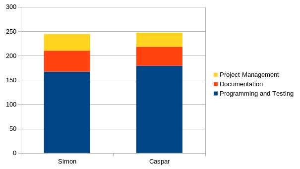
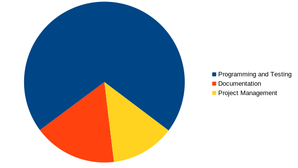

.. _sa_time_tracking:

=============
Time Tracking
=============

In this project, we divided our time tracking into three categories:

- Project Management
- Documentation
- Programming and Testing.

The Project Management category encompassed weekly meetings as well as discussions about architectural changes and potential technologies and libraries. The time allocated to this task remained fairly consistent throughout the project and did not exhibit significant fluctuations.

The Documentation task required the majority of its time towards the end of the project. While we began updating the architectural and domain model sections from the outset, many parts were revised and finalized towards the end to prepare the application for release. In addition, the separation of the engineering project and the study project, as well as the creation of artifacts for the study project, were mainly completed towards the end of the project.

As with the project management the programming and testing was spread widely and only stagnated to the end of the project, where most of the time then went into the improvement of the documentation.

The following two diagrams illustrate the amount of time spent on each task, as well as the task that consumed the most time. The first diagram shows the time spent on each task by individual, as well as the total time spent by each person. The second diagram compares the overall time spent on each task during the project. [#]_

Time spent per Team-Member on tasks
"""""""""""""""""""""""""""""""""""

Time spent on tasks in total
""""""""""""""""""""""""""""

.. [#] The pyramidal configuration of the diagram serves to visually underscore the precision with which it reflects the allocation of time among the diverse tasks at hand, much to our delight.
