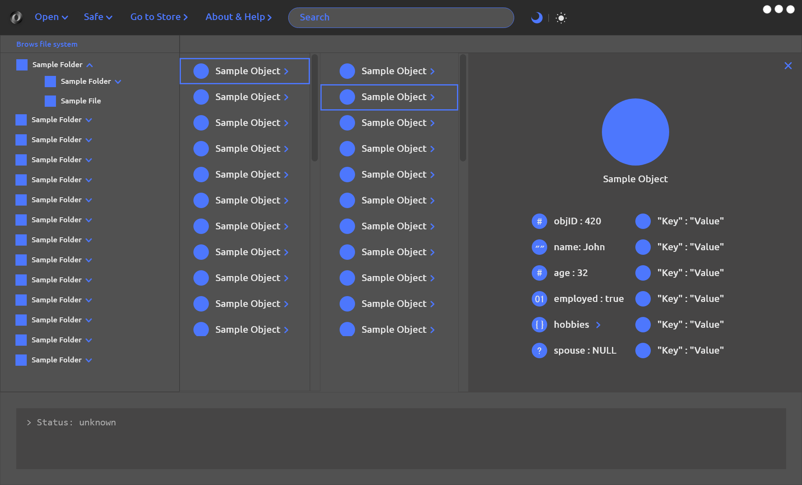
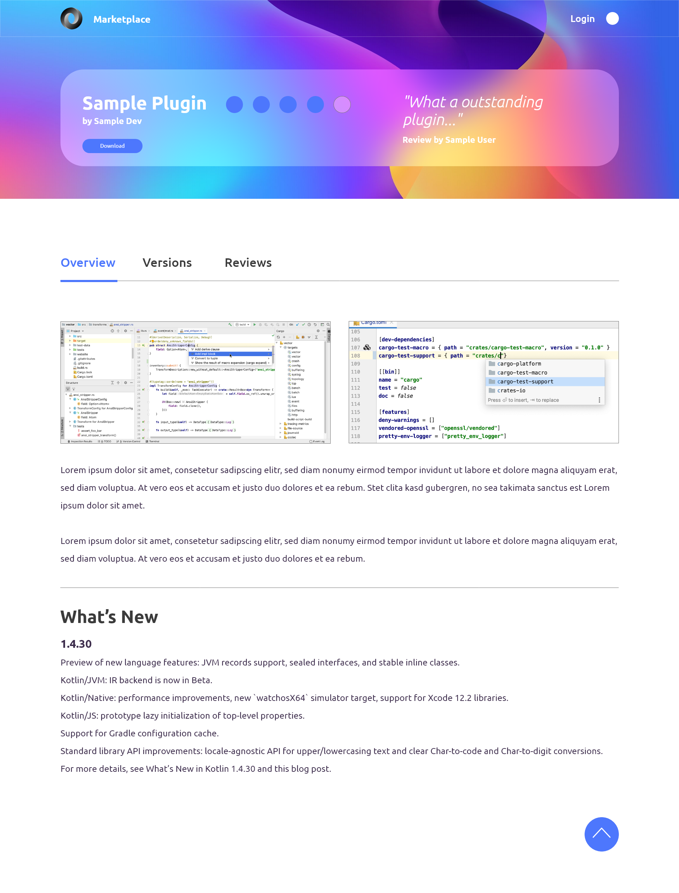
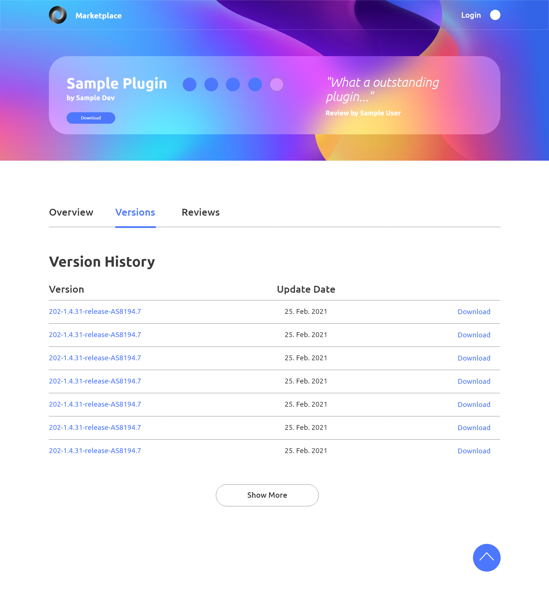

.. _ui_sketches:

===========
UI Sketches
===========

Black Fennec GUI
****************
The Graphical User Interface (GUI) of Black Fennec is very simple and user-friendly. There is a menu in the upper area. There the user can open, create or implement projects. The user can save projects. The extension marketplace can be opened via the "go to store" button. Opened projects can be searched by using the search engine. As a small feature, we are implementing a selection between default and dark mode.

Under the menu bar the user can see an overview of the imported data.

*Black Fennec Main UI and structure presenter:Object detail view containing sample key-value pairs*

Extension Marketplace
*********************
During the creation of the UI sketches we thought that we could create an external website for the extension marketplace, which we then decided against. In place of the external extension store up to version 0.6 an internal extension store was implemented. This was then rendered obsolete by the use of flatpak extensions from version 0.11 onwards. Thanks to the flatpak extension system, Black Fennec no longer needs an internal extension store.

For the sake of completeness - and maybe future reference - the envisioned marketplace is still included.

Initially the website shows an overview of all available extensions and includes a searchengine.

*Black Fennec Extension Store: Main UI*

*Black Fennec Extension Store: Browse by category sample page*

By selecting the desired extension, the user can see an overview of the extension and read a small description of it.

*Black Fennec Extension Store: Sample plugin overview*

*Black Fennec Extension Store: Sample plugin Version History*

*Black Fennec Extension Store: Sample plugin ratings and reviews*