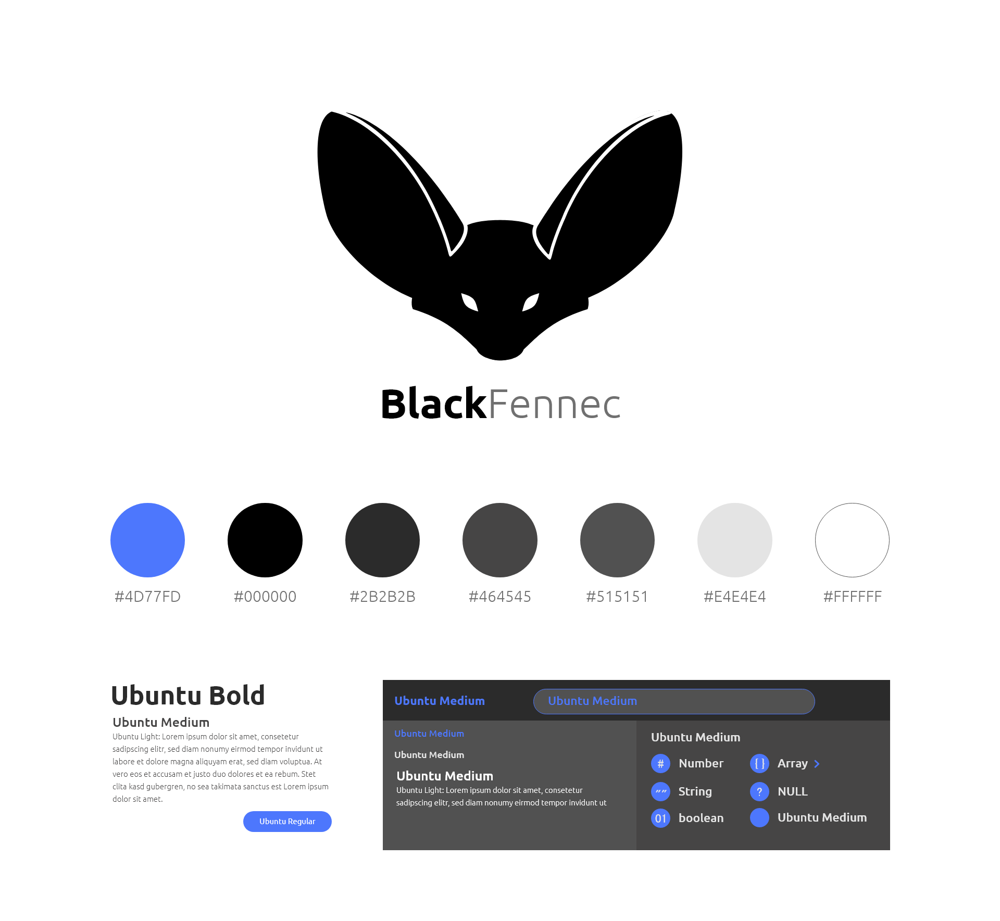

Corporate identity & design
=============================

Overview
*********

Colors
*********

================  ==================
**Hex**           **Suggested use**
#4d77fd             Accent color, title on dark background, links
#000000             reserved for logo (don't use in UI)
#2b2b2b             title on white background, background color
#464545             Subtitle and small text on white background, background color
#515151             background color
#e4e4e4             titles, subtitles and names on dark background
#ffffff             background color
================  ==================

Fonts
*********

================  ==================  ==================
**Font family**   **Suggested use**     **Download**
Ubuntu            Main font             https://fonts.google.com/specimen/Ubuntu?preview.text_type=custom
Oxygen            Secondary font        https://fonts.google.com/specimen/Oxygen?preview.text_type=custom
================  ==================  ==================

