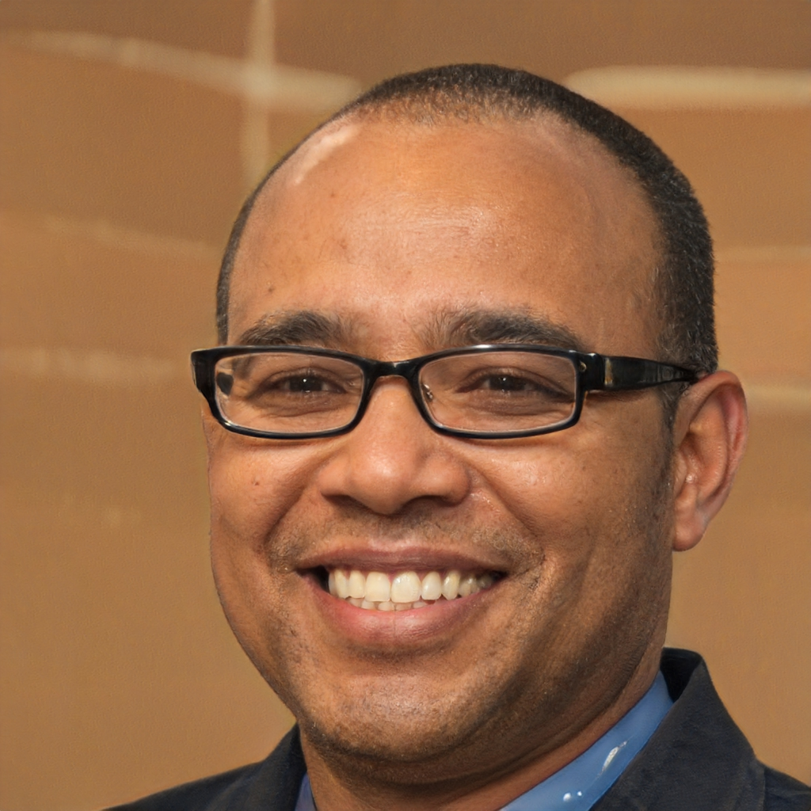
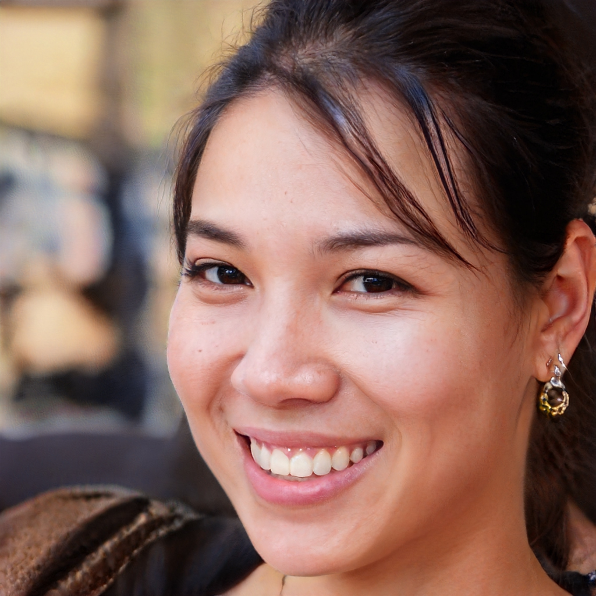

.. _personas:
.. _Personas:

========
Personas
========

.. _Matthew:

******************
Matthew G. Gritton
******************

| **Age:** 52
| **Profession:** self taught web developer (freelancer)
| **Usertyp:** Late Majority
| **Defining Traits:** superficial knowledge, impatient

Wants & Needs:
--------------
- Provide high quality web solutions for small businesses
- Working with extendable tools instead of many specific
- Using tools where no deeper knowledge is needed

Frustrations:
-------------
- New Tools are often hard to understand for him, especially if they lack in UI/UX design

.. _Sun:

**********
Sun Chuang
**********

| **Age:** 26
| **Profession:** Security specialist
| **Usertyp:** Early Adopter
| **Defining Traits:** Self-Motivated, perfectionist, curious

Wants & Needs:
--------------
- Information gathering for her research
- automate tasks and analyze data

Frustrations:
-------------
- Commonly used OSINT tools don't fit her needs
- Additional work needed to compensate for missing features of available tools

.. _Alan:

***********
Alan Nordin
***********

| **Age:** 34
| **Profession:** Extension developer
| **Usertyp:** Early Majority
| **Defining Traits:** Team player, business-oriented

Wants & Needs:
--------------
- Develop extensions for universal use
- publish extensions easily and receive feedback

Frustrations:
-------------
- Many available tools are unflexible and hard to extend