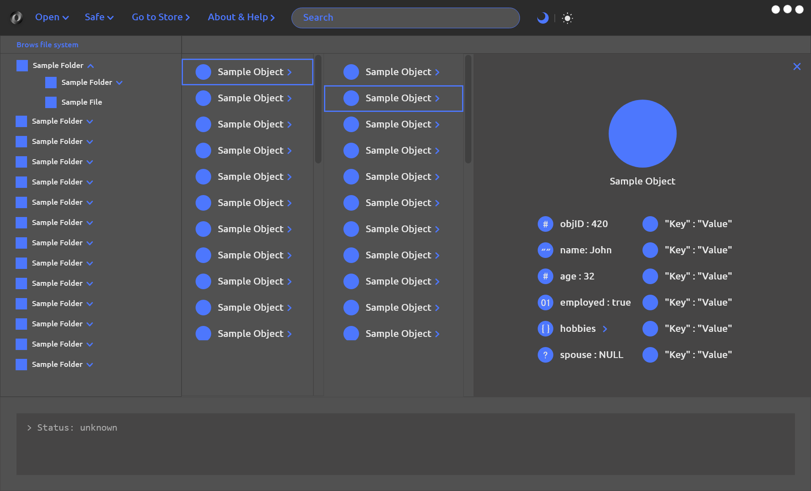
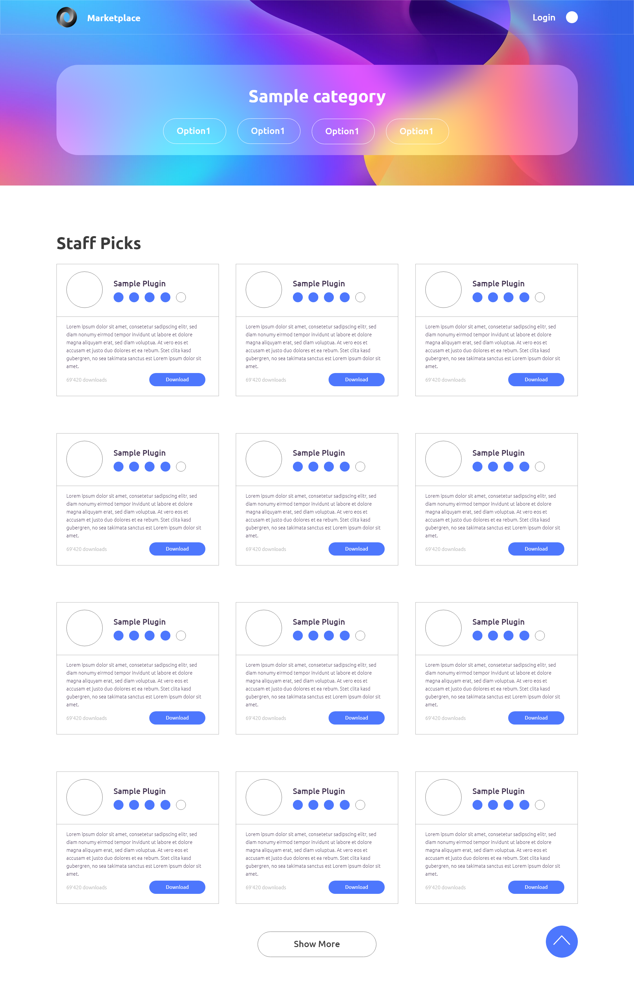
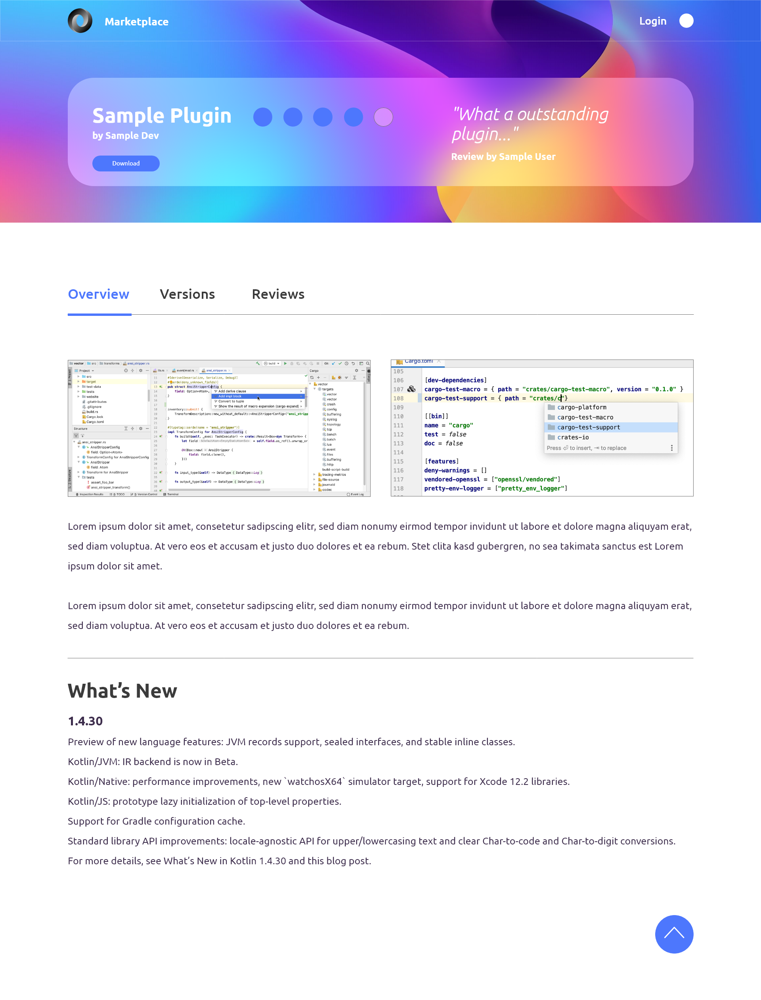
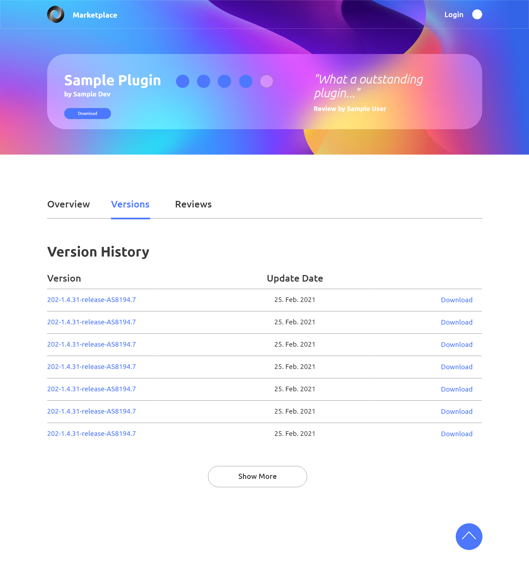
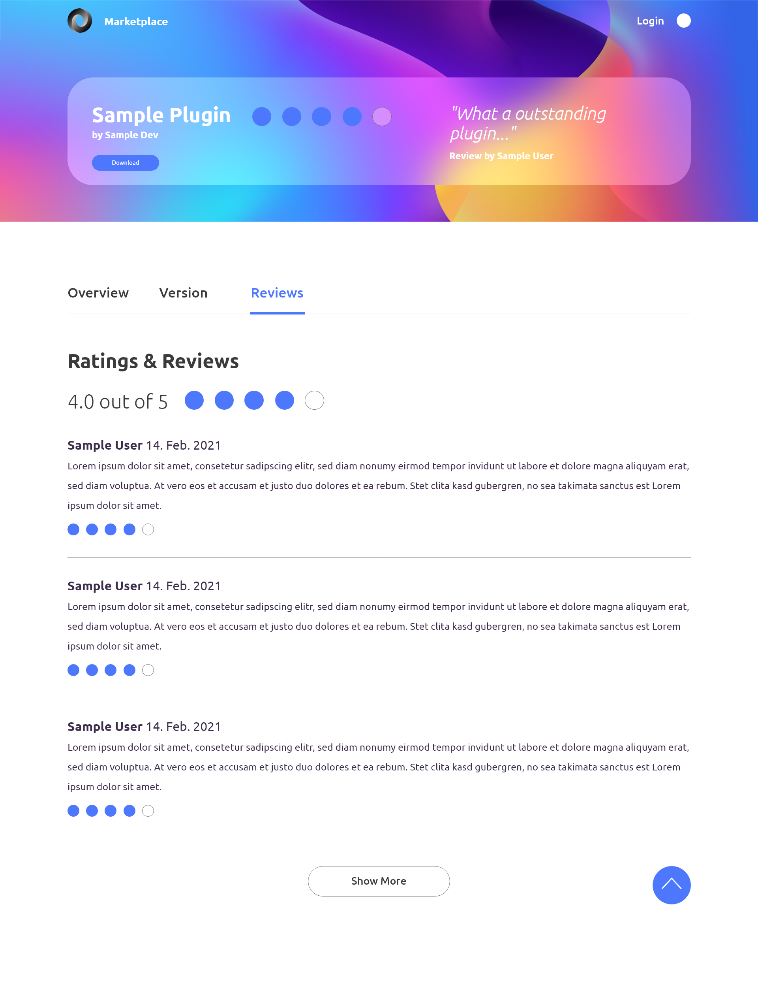

UI Sketches
===========

Black Fennec GUI
****************
The Graphical User Interface (GUI) of Black Fennec is very simple and user-friendly.
There is a menu in the upper area. There the user can open, create or implement projects.
The user can save projects. The extension marketplace can be opened via the "go to store" button.
Opened projects can be searched by using the search engine. As a small feature, we are implementing a selection
between default and dark mode.

Under the menu bar the user can see an overview of the imported data.

*Black Fennec Main UI and info presenter:Object detail view containing sample key-value pairs*

Extension Marketplace
*********************
In our first version of the UI sketches we thought that we could create an external website for the extension
marketplace. But since this would go beyond the scope of our project, we will implement the marketplace directly in the
black fennec GUI. The presentation will remain similar.

The marketplace of our extensions shows an overview of all available extensions and it includes a searchengine.
The user can select the desired extension via the marketplace and install it with a mouse click.
This guarantees user friendliness

*Black Fennec Extension Store: Main UI*

*Black Fennec Extension Store: Browse by category sample page*

By selecting the desired extension, the user can see an overview of the extension and read a small description of it.

*Black Fennec Extension Store: Sample plugin overview*

Originally we wanted to implement a versioning and rating system for the extensions.
After some consideration, however, we realised that this would take too much time.
This will therefore not be implemented in the final product.

*Black Fennec Extension Store: Sample plugin Version History*

*Black Fennec Extension Store: Sample plugin ratings and reviews*