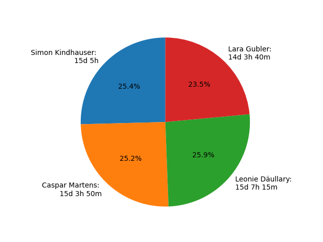

Time Tracking
=============

In this document automatically generated charts based on the Gitlab time tracking features that can be recorded on issues and merge requests will be featured. This is automatically initiated through a CI-Pipeline which with the help of python and the module matplotlib generates charts that contain the data collected via the tool gtt from the Gitlab API. This Pipeline is a Work in Progress, which is why in this version a manually executed python script generated the chart below.

Time spent per Team-Member
**************************

