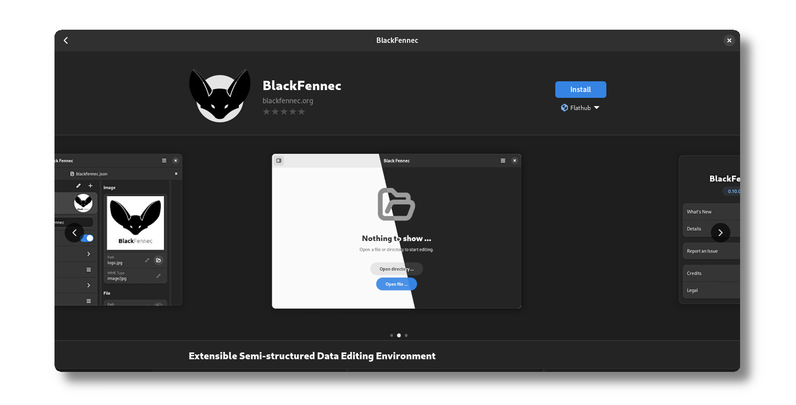
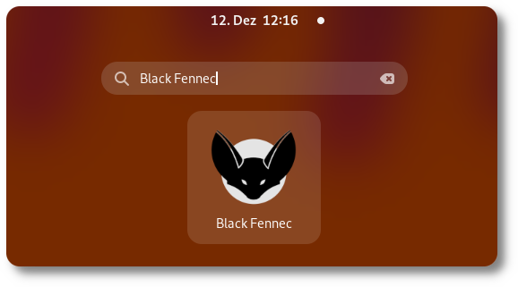

.. _usage:

=====
Usage
=====

Here you will learn how to install and use Black Fennec. This section is intended for users who want to use Black Fennec and somehow stumbled upon this documentation.

If you are of the impatient type and just want to get started, just `download Black Fennec via FlatHub <https://flathub.org/apps/details/org.blackfennec.app>`_.

.. _installation:

Installation
============

The recommended way to install Black Fennec is via FlatHub. FlatHub is a software distribution platform for Linux desktop applications, and is available for all major Linux distributions. It is likely that your distribution already has FlatHub installed. If not, you can install it via your distribution's package manager. A good guide on how to install FlatHub can be found here: https://flatpak.org/setup/.

If you have FlatHub installed properly, you should be able to install Black Fennec through your software manager of choice. In the case of GNOME Software, you can search for Black Fennec and install it from there.

Alternatively, you can install Black Fennec by downloading the `.flatpakref` file from the FlatHub website. This file, when opened, should give you the option to install Black Fennec.

.. image:: https://flathub.org/assets/badges/flathub-badge-en.png
    :alt: Download Black Fennec from FlatHub
    :align: center
    :target: https://flathub.org/apps/details/org.blackfennec.app
    :width: 200

Extensions
**********

Black Fennec can be enhanced with extensions. It is possible to develop your own extensions. An introduction for which can be found in the :ref:`Extension Development <definition_extension_development>` section of this documentation. The `core` and `base` extensions should be installed by default. In fact, Black Fennec will warn you if they are not installed. 

Extensions can be installed through your software manager of choice. In the case of GNOME Software, you should see a list of available extensions just below the application description in a section called `Add-ons`. Installing an extension is as simple as clicking the checkbox.

.. _running:

Running Black Fennec
====================

Once you have installed Black Fennec, you can run it by searching for it in your application launcher. In GNOME, you can search for Black Fennec in the Activities Overview.

Black Fennec starting with version 0.11 also registers for the mime type `application/json`. This means that you can open JSON files with Black Fennec by double clicking them in your file manager. If you have another application installed to handle JSON you might need to use the `open with` option.

.. _command_line:

Command Line
============

If you want to install Black Fennec using the command line you can use the command below if Flatpak and FlatHub are installed correctly.

.. code-block:: bash

    flatpak install flathub org.blackfennec.app

Running Black Fennec from the command line is possible by using the command below.

.. code-block:: bash

    flatpak run org.blackfennec.app

Installing extensions is also possible from the command line. The command below installs the `core` extension.

.. code-block:: bash

    flatpak install flathub org.blackfennec.app.extension.core
